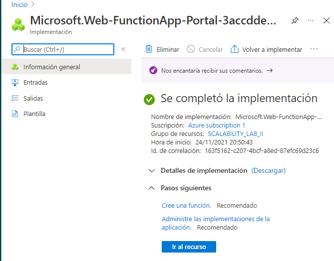
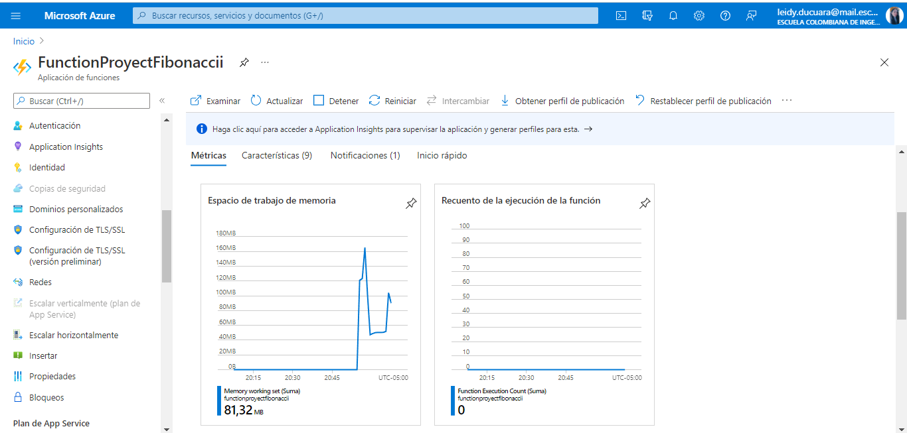
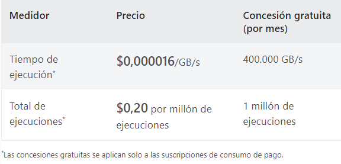
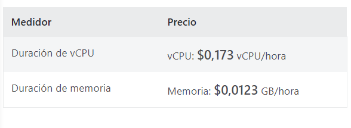

### Escuela Colombiana de Ingeniería
### Arquitecturas de Software - ARSW

## Escalamiento en Azure con Maquinas Virtuales, Sacale Sets y Service Plans

### Dependencias
* Cree una cuenta gratuita dentro de Azure. Para hacerlo puede guiarse de esta [documentación](https://azure.microsoft.com/en-us/free/search/?&ef_id=Cj0KCQiA2ITuBRDkARIsAMK9Q7MuvuTqIfK15LWfaM7bLL_QsBbC5XhJJezUbcfx-qAnfPjH568chTMaAkAsEALw_wcB:G:s&OCID=AID2000068_SEM_alOkB9ZE&MarinID=alOkB9ZE_368060503322_%2Bazure_b_c__79187603991_kwd-23159435208&lnkd=Google_Azure_Brand&dclid=CjgKEAiA2ITuBRDchty8lqPlzS4SJAC3x4k1mAxU7XNhWdOSESfffUnMNjLWcAIuikQnj3C4U8xRG_D_BwE). Al hacerlo usted contará con $200 USD para gastar durante 1 mes.

### Parte 0 - Entendiendo el escenario de calidad

Adjunto a este laboratorio usted podrá encontrar una aplicación totalmente desarrollada que tiene como objetivo calcular el enésimo valor de la secuencia de Fibonnaci.

**Escalabilidad**
Cuando un conjunto de usuarios consulta un enésimo número (superior a 1000000) de la secuencia de Fibonacci de forma concurrente y el sistema se encuentra bajo condiciones normales de operación, todas las peticiones deben ser respondidas y el consumo de CPU del sistema no puede superar el 70%.

### Escalabilidad Serverless (Functions)

1. Cree una Function App tal cual como se muestra en las  imagenes.

Como vemos en la imagen la Function App es creada con exito

2. Instale la extensión de **Azure Functions** para Visual Studio Code.

3. Despliegue la Function de Fibonacci a Azure usando Visual Studio Code. La primera vez que lo haga se le va a pedir autenticarse, siga las instrucciones.

Ahora podeos ver que la app se desplego con exito en azure ya que nos empieza a mostrar metricas del consumo 

4. Dirijase al portal de Azure y pruebe la function.

5. Modifique la coleción de POSTMAN con NEWMAN de tal forma que pueda enviar 10 peticiones concurrentes. Verifique los resultados y presente un informe.

6. Cree una nueva Function que resuleva el problema de Fibonacci pero esta vez utilice un enfoque recursivo con memoization. Pruebe la función varias veces, después no haga nada por al menos 5 minutos. Pruebe la función de nuevo con los valores anteriores. ¿Cuál es el comportamiento?.

**Preguntas**

* ¿Qué es un Azure Function?

Functions proporciona proceso sin servidor para Azure. Es un servicio que proporciona la estructura y los recursos en la nube para subir fragmentos de codigo que ella se encarga de ejecutar y probar. Functions también se puede usar para crear API web, responder a los cambios en las bases de datos, procesar secuencias de IoT, administrar colas de mensajes, etc.

* ¿Qué es serverless?

Es la computación sin servidor, es decir existe un provedor como Azure, AWS o Google cloud, que se hace responsable de ejecutar el fragmento de codigo mediante la asignación dinamica de recursos. 

AWS: AWS Lambda
Microsoft Azure: Azure Functions
Google Cloud: Cloud Functions

Para usar este nuevo modelo debemos desarrollar nuestras aplicaciónes con una arquitectura basada en microservicios 

* ¿Qué es el runtime y que implica seleccionarlo al momento de crear el Function App?

El runtime carga todas las aplicaciones de un programa y las ejecuta en la plataforma. Esta plataforma pone a disposición todos los recursos necesarios para ejecutar el programa independientemente del sistema operativo.

* ¿Por qué es necesario crear un Storage Account de la mano de un Function App?

Al crear una aplicación de funciones, debe crear o vincular una cuenta de Azure Storage de uso general compatible con Blob, Queue y Table Storage. El motivo es que Azure Functions usa Azure Storage con ciertas operaciones; por ejemplo, para administrar los desencadenadores y ejecutar las funciones de registro. 

* ¿Cuáles son los tipos de planes para un Function App?, ¿En qué se diferencias?, mencione ventajas y desventajas de cada uno de ellos.

1. Plan de Consumo

Escala de forma automática y uno paga los recursos de proceso solo cuando se ejecuten las funciones.

En el plan de consumo, las instancias del host de Functions se agregan y quitan de forma dinámica según el número de eventos de entrada.

Ventajas

✔ Plan de hospedaje predeterminado.
✔ Pague solo cuando se ejecutan las funciones.
✔ Escala de forma automática, incluso durante períodos de carga elevada.

2. Plan Premium

Escala automáticamente en función de la demanda mediante trabajos preparados previamente que ejecutan aplicaciones sin ningún retraso después de estar inactivas, ejecuta en instancias más eficaces y se conecta a redes virtuales.

Se onsidera elegir el plan Premium de Azure Functions en las siguientes situaciones:

✔ La aplicación de funciones se ejecuta de forma continua, o casi continua.
✔ Tiene un gran número de ejecuciones pequeñas y una factura de ejecución elevada, pero pocos GB por segundo en el plan de consumo.
✔ Necesita más opciones de CPU o memoria de las que proporciona el plan de consumo.
✔ El código debe ejecutarse durante más tiempo del máximo permitido en el plan de consumo.
✔ Se necesitan características que no están disponibles en el plan de consumo, como la conectividad con red virtual.
✔ Quiere proporcionar una imagen personalizada de Linux en la que ejecutar sus funciones

3. Plan dedicado

Ejecute las funciones en un plan de App Service a los Precios de App Service normales.

Mejor para escenarios de ejecución prolongada en los que no se puede usar Durable Functions. Considere el plan de App Service en las situaciones siguientes:

✔ Tiene máquinas virtuales infrautilizadas que ya ejecutan otras instancias de App Service.
✔ Se requieren escalado y costos predictivos.

Tambien hay opciones de hospedaje como:

1. ASE 

App Service Environment (ASE) es una característica de App Service que proporciona un entorno completamente aislado y dedicado para ejecutar de forma segura las aplicaciones de App Service a gran escala.

Las instancias de ASE son adecuadas para cargas de trabajo de aplicaciones que necesitan:

✔ Una gran escala.
✔ Aislamiento de proceso completo y acceso a redes seguro.
✔ Elevado uso de memoria

2. Kubernetes

Kubernetes proporciona un entorno completamente aislado y dedicado que se ejecuta sobre la plataforma de Kubernetes.

Kubernetes resulta adecuado para cargas de trabajo de aplicaciones que necesitan:
✔ Requisitos de hardware personalizados.
✔ Aislamiento y acceso a redes seguro.
✔ Capacidad de ejecutarse en entornos híbridos o de varias nubes.
✔ Ejecutarse junto con aplicaciones y servicios de Kubernetes existentes.

* ¿Por qué la memoization falla o no funciona de forma correcta?

Utilizando el enfoque de memoización (guardar los valores que ya han sido calculados para utilizarlos posteriormente). Así, rellenaríamos una tabla con los resultados de los distintos subproblemas, para reutilizarlos cuando haga falta en lugar de volver a calcularlos. Empieza a fallar cuando los nueros son demasiado grandes.

* ¿Cómo funciona el sistema de facturación de las Function App?

Los precios pueden variar en función del tipo de contrato suscrito con Microsoft, la fecha de compra y el tipo de cambio. Los precios se calculan en dólares estadounidenses y se convierten utilizando los tipos de referencia de Thomson Reuters actualizados el primer día de cada mes natural.

El plan de consumo de Azure Functions se factura en función del consumo de recursos y las ejecuciones por segundo. Los precios del plan de consumo incluyen una concesión gratuita mensual de 1 millones de solicitudes y 400.000 GB-segundos de consumo de recursos por suscripción en el modelo de precios de pago por uso, para todas las aplicaciones de funciones de esa suscripción. 

El plan Azure Functions Premium proporciona un rendimiento mejorado y se factura por segundo en función del número de vCPU/s y de GB/s que consuman sus funciones premium. Los clientes también puede ejecutar Functions dentro de su plan de App Service a las tarifas normales del plan de App Service.

